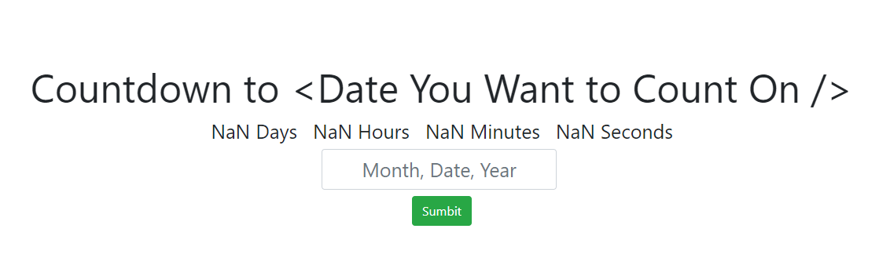

# React-CountDown
A Timer React Application which can be use to countdown the exact number of Days, Hours, Minutes and Seconds for a particular date user mention.

**Completely made using ReactJS. A popular well known JavaScript framework used for front end development.**

After cloning the App make sure to install the node_modules by running `npm i --save` command in the React-CountDown folder and finally run the app using `npm start`.

> Below shown the screenshot of the this app in work.

